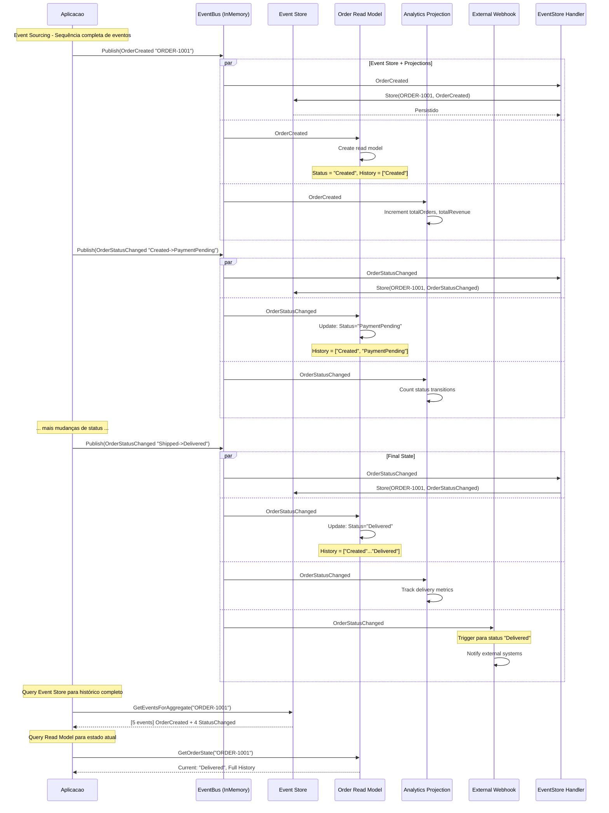

# Event Notification - Diagrama de Sequência

- **Objetivo**: Event Sourcing completo com múltiplas projeções especializadas
- **Funcionalidades Avançadas**:
  - Event Store (persiste todos os eventos para auditoria)
  - CQRS Read Models (estado otimizado para consulta)  
  - Multiple Projections (Analytics, Webhook, Read Model)
  - Event replay capability (reconstrução de estado)
  - External system integration (webhooks condicionais)
