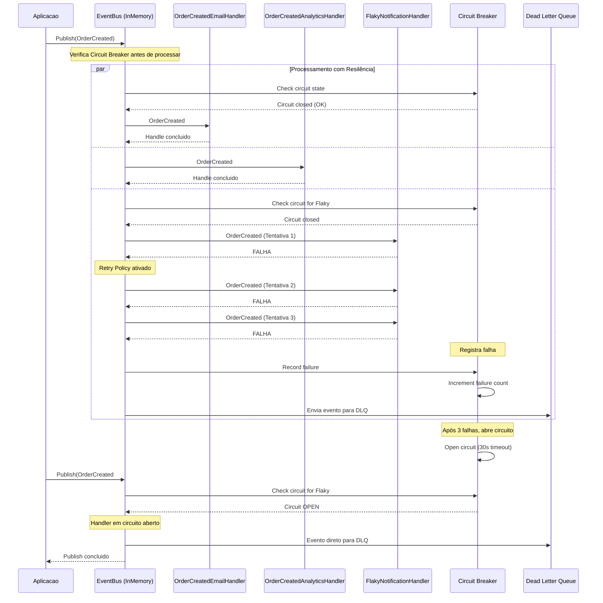

# Publisher/Subscriber - Diagrama de Sequência

- **Objetivo**: Distribuição resiliente de eventos para múltiplos consumidores
- **Funcionalidades Avançadas**: 
  - Circuit Breaker (isola handlers problemáticos)
  - Dead Letter Queue (eventos com falha)  
  - Retry Policy (3 tentativas com backoff)
  - Processamento paralelo independente
