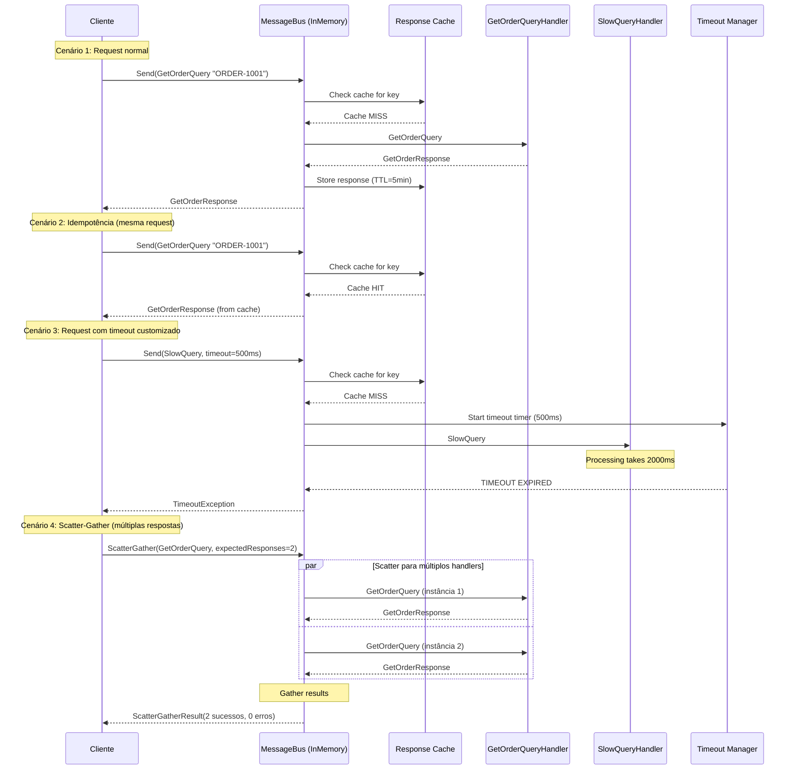

# Request/Response Assíncrono - Diagrama de Sequência

- **Objetivo**: Comunicação assíncrona com retorno garantido e funcionalidades enterprise
- **Funcionalidades Avançadas**:
  - Timeout configurável (default 30s, customizável)
  - Idempotência com cache TTL (evita processamento duplicado)
  - Scatter-Gather para consultas paralelas
  - Exception handling robusto

