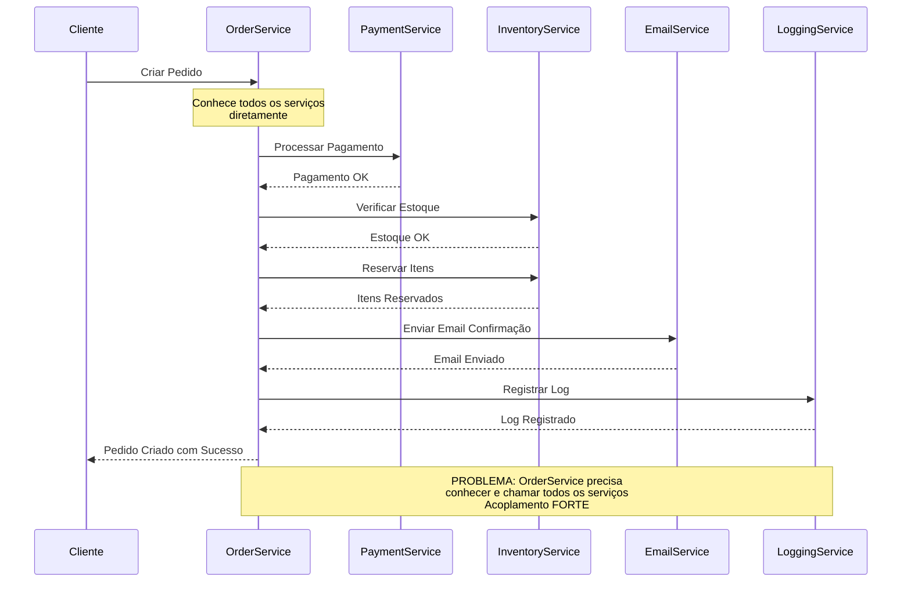
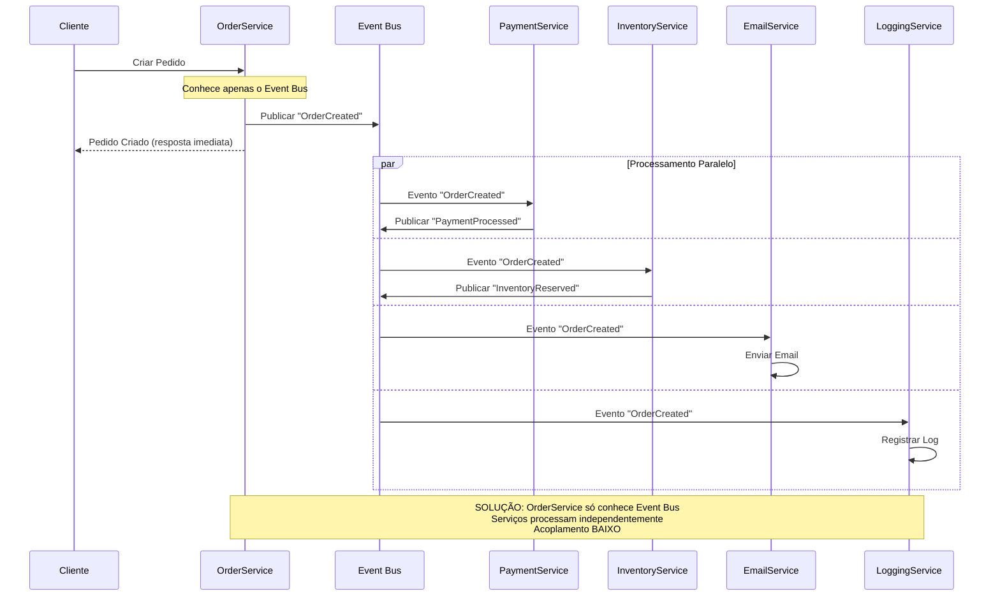

# Problema: Acoplamento Forte entre Componentes

## Descrição do Problema

Em arquiteturas tradicionais, os componentes do sistema precisam conhecer e chamar diretamente outros componentes, criando dependências rígidas que dificultam a manutenção, evolução e escalabilidade do sistema.

## Cenário: Sistema de E-commerce - Criação de Pedido

### Arquitetura Tradicional (Sem EDA)

#### Problemas Identificados:
- **Alto Acoplamento**: OrderService precisa conhecer todos os outros serviços
- **Dependências Rígidas**: Mudanças em um serviço afetam o OrderService
- **Processamento Sequencial**: Operações executadas uma após a outra
- **Ponto de Falha Único**: OrderService concentra muita responsabilidade

### Arquitetura com EDA

#### Benefícios Obtidos:
- **Baixo Acoplamento**: OrderService conhece apenas o Event Bus
- **Independência**: Serviços não conhecem uns aos outros
- **Processamento Paralelo**: Múltiplas operações simultâneas
- **Responsividade**: Cliente recebe resposta imediata
- **Flexibilidade**: Fácil adição/remoção de consumidores
