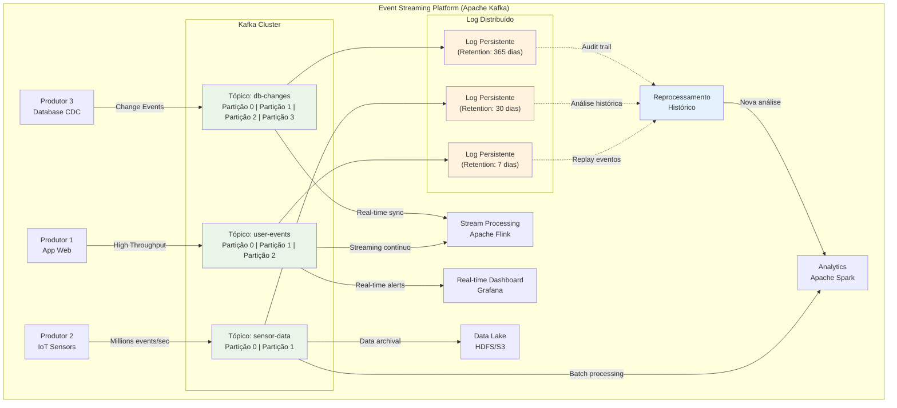

```mermaid
graph TB
    subgraph "Event Streaming Platform (Apache Kafka)"
        Producer1["Produtor 1<br/>App Web"]
        Producer2["Produtor 2<br/>IoT Sensors"]
        Producer3["Produtor 3<br/>Database CDC"]
        
        subgraph "Kafka Cluster"
            Topic1["Tópico: user-events<br/>Partição 0 | Partição 1 | Partição 2"]
            Topic2["Tópico: sensor-data<br/>Partição 0 | Partição 1"]
            Topic3["Tópico: db-changes<br/>Partição 0 | Partição 1 | Partição 2 | Partição 3"]
        end
        
        subgraph "Log Distribuído"
            Log1["Log Persistente<br/>(Retention: 7 dias)"]
            Log2["Log Persistente<br/>(Retention: 30 dias)"]
            Log3["Log Persistente<br/>(Retention: 365 dias)"]
        end
        
        Consumer1["Stream Processing<br/>Apache Flink"]
        Consumer2["Analytics<br/>Apache Spark"]
        Consumer3["Real-time Dashboard<br/>Grafana"]
        Consumer4["Data Lake<br/>HDFS/S3"]
        
        Reprocess["Reprocessamento<br/>Histórico"]
    end
    
    Producer1 -->|"High Throughput"| Topic1
    Producer2 -->|"Millions events/sec"| Topic2
    Producer3 -->|"Change Events"| Topic3
    
    Topic1 --> Log1
    Topic2 --> Log2
    Topic3 --> Log3
    
    Topic1 -->|"Streaming contínuo"| Consumer1
    Topic2 -->|"Batch processing"| Consumer2
    Topic1 -->|"Real-time alerts"| Consumer3
    Topic2 -->|"Data archival"| Consumer4
    Topic3 -->|"Real-time sync"| Consumer1
    
    Log1 -.->|"Replay eventos"| Reprocess
    Log2 -.->|"Análise histórica"| Reprocess
    Log3 -.->|"Audit trail"| Reprocess
    
    Reprocess -->|"Nova análise"| Consumer2
    
    style Topic1 fill:#e8f5e8
    style Topic2 fill:#e8f5e8
    style Topic3 fill:#e8f5e8
    style Log1 fill:#fff3e0
    style Log2 fill:#fff3e0
    style Log3 fill:#fff3e0
    style Reprocess fill:#e3f2fd
```
