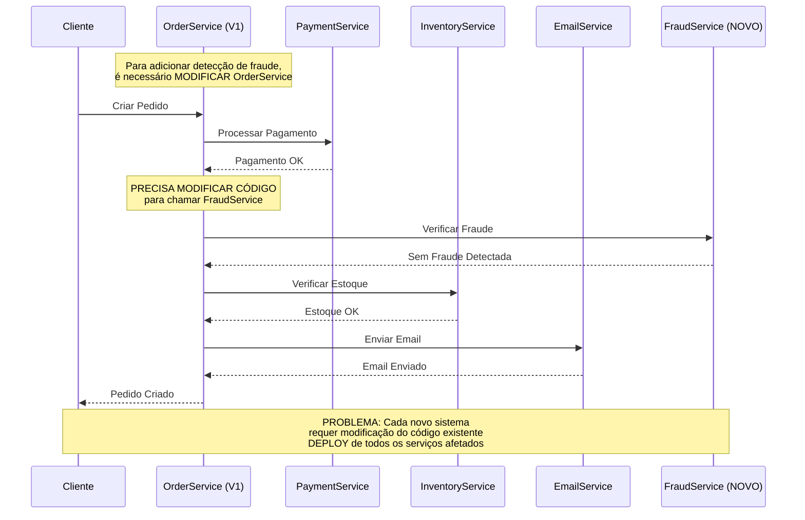
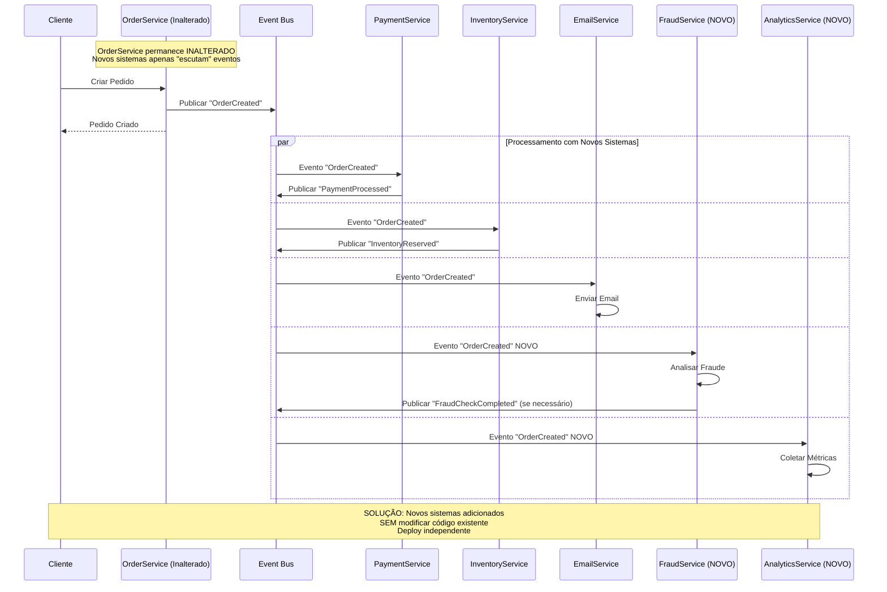

# Problema: Dificuldade para Integração de Sistemas

## Descrição do Problema

Em arquiteturas tradicionais, adicionar novos sistemas ou funcionalidades requer modificações extensas no código existente, criando um efeito cascata de mudanças, deployments coordenados e risco de introduzir bugs em sistemas estáveis.

## Cenário: Adicionando Detecção de Fraude ao E-commerce

### Arquitetura Tradicional - Modificações Necessárias

#### Problemas Identificados:
- **Modificação de Código Existente**: OrderService precisa ser alterado
- **Deployments Coordenados**: Múltiplos serviços precisam ser atualizados
- **Risco de Regressão**: Mudanças podem introduzir bugs em funcionalidades estáveis
- **Time to Market Lento**: Cada nova funcionalidade requer refatoração
- **Testes Complexos**: Necessário re-testar toda a cadeia

### Arquitetura com EDA - Integração Transparente

 
