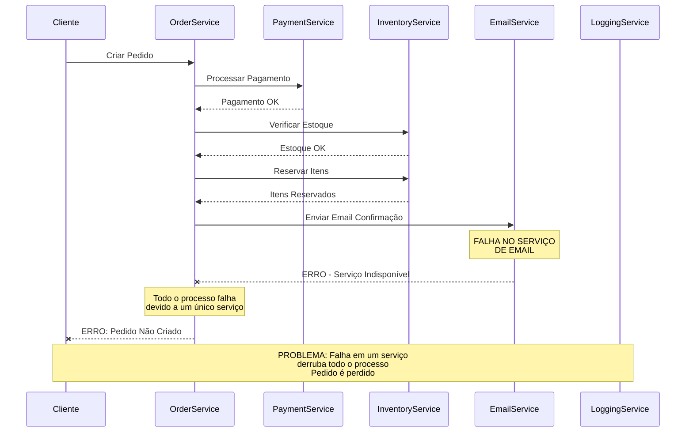
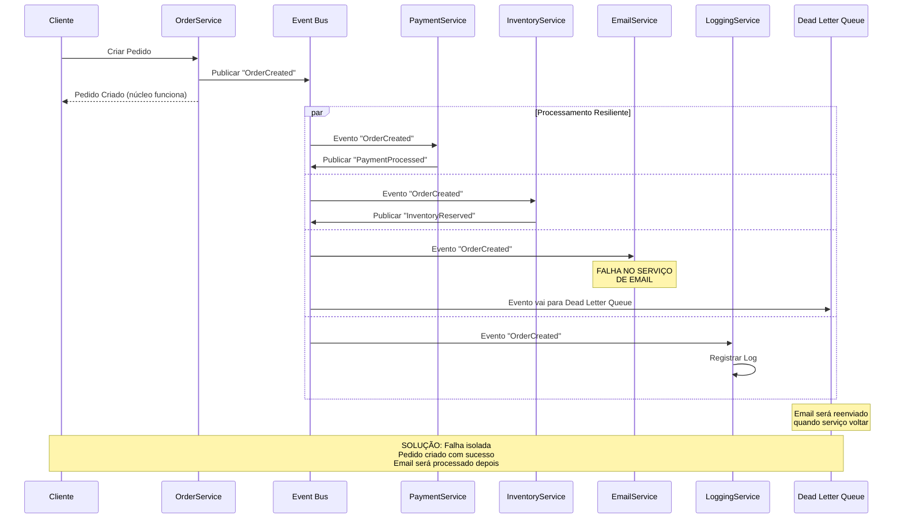

# Problema: Resiliência e Disponibilidade

## Descrição do Problema

Em arquiteturas tradicionais síncronas, a falha de um único componente pode causar o colapso de todo o processo de negócio, resultando em baixa disponibilidade e experiência ruim para o usuário. Este é conhecido como o problema do "ponto único de falha".

## Cenário: Sistema de E-commerce - Falha no Serviço de Email

### Arquitetura Tradicional - Com Falha

#### Problemas Identificados:
- **Efeito Cascata**: Falha em um serviço não-crítico derruba todo o processo
- **Perda de Transação**: Pedido completamente perdido devido a falha menor
- **Experiência Ruim**: Cliente não consegue completar compra
- **Rollback Complexo**: Necessário desfazer operações já realizadas

### Arquitetura com EDA - Resiliente a Falhas

 
